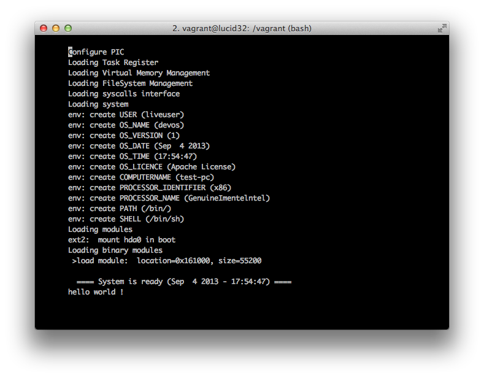

How to Make a Computer Operating System
=======================================

Online book about how to write a computer operating system in C/C++ from scratch.

**Book**: An online version is available at [https://avernaza.gitbook.io/os-2019/](https://avernaza.gitbook.io/os-2019/) (PDF, Mobi and ePub). It was generated using [GitBook](https://www.gitbook.com/).

**Source Code**: All the system source code will be stored in the [src](https://github.com/dsapandora/OS_2019/tree/master/src) directory. Each step will contain links to the different related files.

**Contributions**: This course is open to contributions, feel free to signal errors with issues or directly correct the errors with pull-requests.

**Questions**: Feel free to ask any questions by adding issues or commenting sections.

You can follow me on Twitter [@dsapandora](https://twitter.com/dsapandora) or [GitHub](https://github.com/dsapandora).

### What kind of OS are we building?

The goal is to build a very simple UNIX-based operating system in C++, not just a "proof-of-concept". The OS should be able to boot, start a userland shell, and be extensible.

